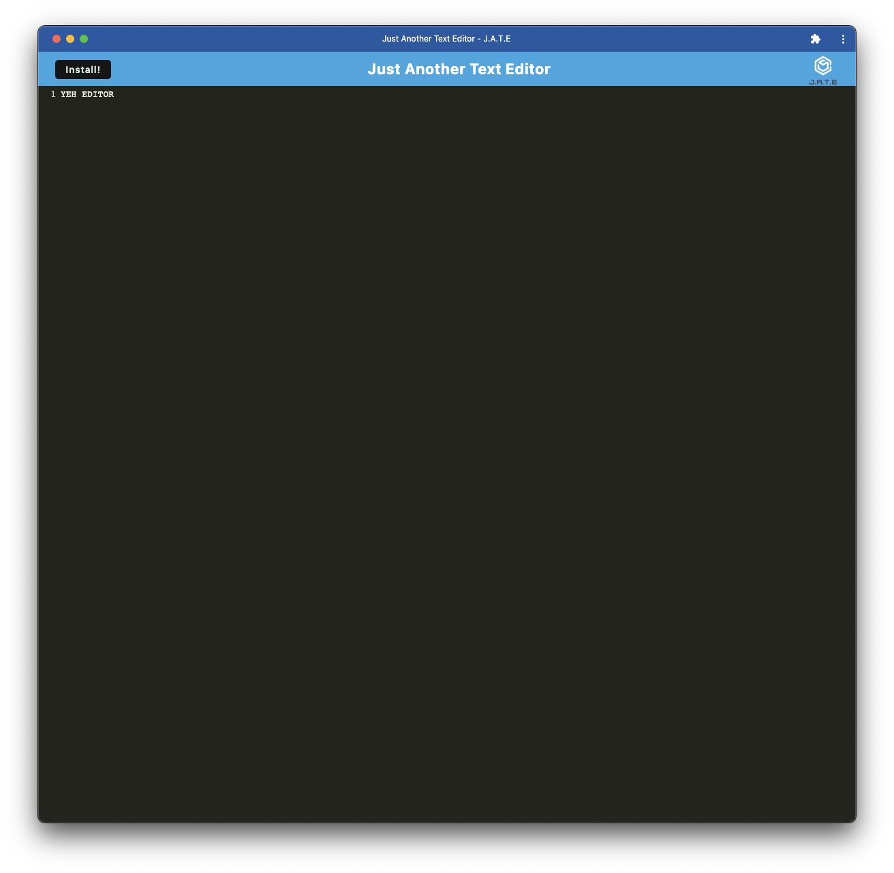

# Yeh JATE Editor

## Table of contents

- [Overview](#overview)
  - [The challenge](#the-challenge)
  - [User Story](#user-story)
  - [Acceptance Criteria](#acceptance-criteria)
  - [Screenshot](#screenshot)
  - [Links](#links)
- [My process](#my-process)
  - [Built with](#built-with)
  - [What I learned](#what-i-learned)
  - [Continued development](#continued-development)
  - [Useful resources](#useful-resources)
- [Author](#author)

## Overview

### The challenge

The challenge of this assignment is to create a text editor that runs in the browser and can be installed for offline use. It also saves the state of the application using caching.

### User Story

AS A developer  
I WANT to create notes or code snippets with or without an internet connection  
SO THAT I can reliably retrieve them for later use

### Acceptance Criteria

GIVEN a text editor web application  
WHEN I open my application in my editor  
THEN I should see a client server folder structure  
WHEN I run `npm run start` from the root directory  
THEN I find that my application should start up the backend and serve the client  
WHEN I run the text editor application from my terminal  
THEN I find that my JavaScript files have been bundled using webpack  
WHEN I run my webpack plugins  
THEN I find that I have a generated HTML file, service worker, and a manifest file  
WHEN I use next-gen JavaScript in my application  
THEN I find that the text editor still functions in the browser without errors  
WHEN I open the text editor  
THEN I find that IndexedDB has immediately created a database storage  
WHEN I enter content and subsequently click off of the DOM window  
THEN I find that the content in the text editor has been saved with IndexedDB  
WHEN I reopen the text editor after closing it  
THEN I find that the content in the text editor has been retrieved from our IndexedDB  
WHEN I click on the Install button  
THEN I download my web application as an icon on my desktop  
WHEN I load my web application  
THEN I should have a registered service worker using workbox  
WHEN I register a service worker  
THEN I should have my static assets pre cached upon loading along with subsequent pages and static assets  
WHEN I deploy to Heroku  
THEN I should have proper build scripts for a webpack application

### Screenshot

### Links

- Solution URL: [/ayeh6/Yeh-JATE-Editor](https://github.com/ayeh6/Yeh-Editor)

## My process

### Built with

- Javascript
- Node
- Express
- Webpack
- Workbox

### What I learned

What I learned from this assignment is how in depth the documentation for webpack is and how disorganized it can be. There wasn't much coding thought, but more thought on reading documentation and getting things to compile correctly.

### Continued development

As for continued development, I would like to build off of this and make a saving feature at least. It is pretty nice to have a custom barebones text editor compared to the default ones on Mac and Windows.

### Useful resources

- [Webpack Documentation](https://webpack.js.org/concepts/) - This resource helped with understanding how webpack works.
- [Workbox Plugin](https://developer.chrome.com/docs/workbox/modules/workbox-webpack-plugin/) - This resource helped with figuring out how to use the workbox webpack plugin.

## Author

- Website - [Andrew Yeh](https://ayeh6.github.io/Yeh-Andrew-Portfolio-Website/)
- LinkedIn - [/in/ayeh6](https://www.linkedin.com/in/ayeh6/)
